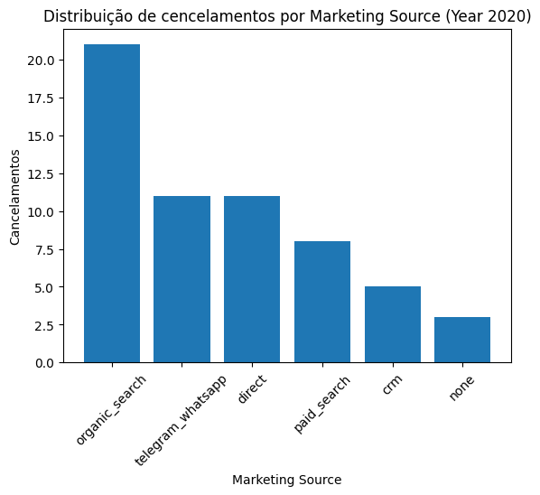
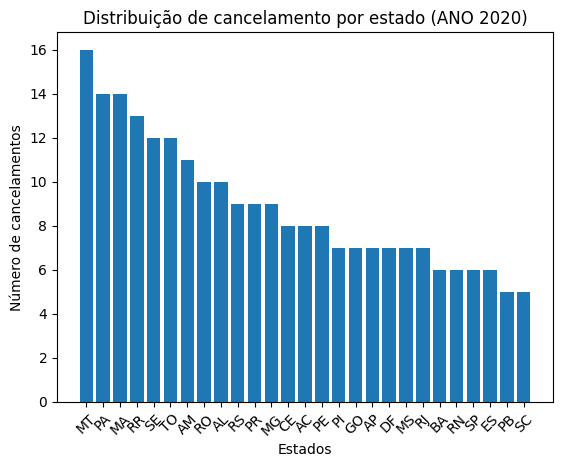
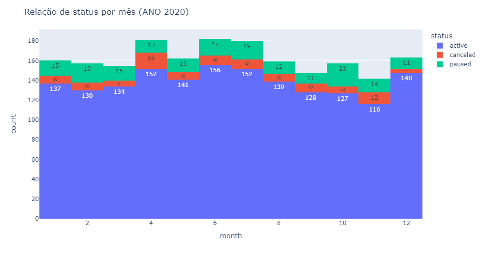
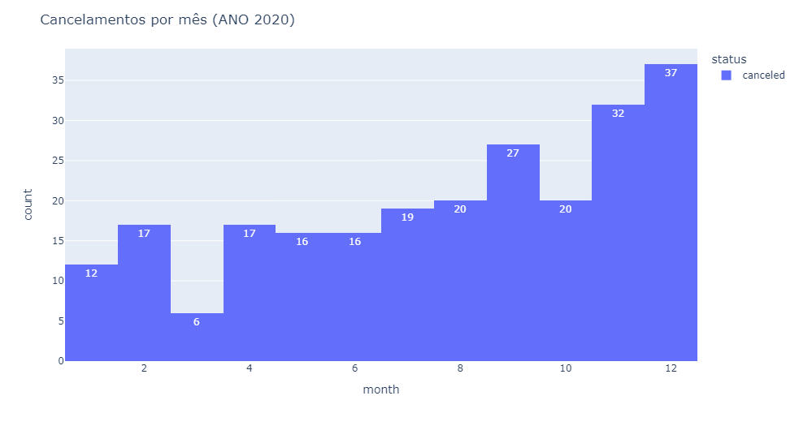

# churn_analyses

# Análise de Churn 

## Sumário

* [Linguagens e tecnologias usadas](#linguagens-e-tecnologias-usadas)
* [Passo a passo da solução](#passo-a-passo-da-solução)
* [Gráficos](#gráficos)
* [Conclusões](#conclusões)

## Linguagens e tecnologias usadas

* [Jupyter Notebook](https://jupyter.org/)
* [Visual Studio Code](https://code.visualstudio.com/download)
* [Python 3.11](https://www.python.org/)
* [Markdown](https://www.markdownguide.org/)

## Passo a passo da solução

* Passo 1: Importar a base de dados
* Passo 2: Visualizar a base de dados
* Passo 3: Tratar os dados
    * 3.1 Verificar as variáveis de cada coluna
    * 3.2 Excluir colunas desnecessárias
* Passo 4: Analisar os dados
    * 4.1 Analisar Graficamente

## Gráficos 

Com o código, foram gerados 4 gráficos, que são os mostrados abaixo.

O primeiro gráfico mostra o total de cancelamentos em relação ao canal de marketing que converteu a assinatura:

O segundo gráfico mostra o total de cancelamentos em relação a cada estado.

O terceiro gráfico mostra a relação de status de cada mês do ano.

O quarto gráfico mostra o cancelamento em cada mês.

## Conclusões

Com base na análise dos gráficos e nas tendências observadas em empresas de assinaturas de serviços, podemos sugerir estratégias para aumentar a fidelidade dos clientes e tornar os serviços mais atrativos. Uma abordagem eficaz pode ser o uso de promoções e planos personalizados para direcionar os clientes para métodos que incentivem sua fidelização.

Essas estratégias alinham os interesses dos clientes e da empresa, criando um ambiente favorável para o aumento da satisfação e retenção dos clientes. Empresas de diferentes setores, como telecomunicações e streaming, têm obtido sucesso ao adotar essa abordagem.

A implementação de promoções específicas, como descontos exclusivos para clientes fiéis, incentivos para adesão a planos de longo prazo ou benefícios extras para clientes engajados, pode ser uma maneira efetiva de encorajar a fidelidade do cliente. Essas ações podem ser combinadas com análises contínuas dos dados do cliente para segmentar e personalizar as ofertas, atendendo às necessidades e preferências individuais.

## Insights

### <b> Sobre o canal de marketing que converteu a assinatura </b>

**Aprendizados:** Nesse tópico, pode-se observar que a maioria das assinaturas são convertidas pela procura do próprio cliente.

**Próximos Passos:** A análise mostra que a procura orgânica é um canal eficaz para atrair clientes fiéis. Portanto, é importante investir em estratégias de marketing e SEO para melhorar a visibilidade da empresa nos mecanismos de busca e direcionar mais tráfego orgânico. Isso pode envolver a criação de conteúdo relevante, otimização do site e presença ativa nas redes sociais. Analisar os dados de clientes que converteram organicamente pode revelar aspectos da experiência que os tornaram mais propensos a se tornarem fiéis. Identifcar os pontos de contato relevantes, como a jornada do usuário, atendimento ao cliente e facilidade de uso do serviço. Ao aprimorar esses aspectos, é possível melhorar a satisfação e retenção dos clientes.

### <b> Sobre o total de cancelamentos em relação a cada estado </b>

**Próximos Passos:** Utilizar os dados disponíveis para segmentar os clientes desses estados e criar ofertas personalizadas que atendam às suas necessidades e preferências. Isso pode envolver descontos específicos, benefícios extras ou recursos adicionais que sejam relevantes para esses clientes. Além disso, garanta que as comunicações sejam direcionadas e transmitam valor específico para cada segmento de clientes. 

### <b> Sobre o cancelamento em cada mês </b>

**Aprendizados:** Os últimos meses do ano podem ser uma época de transição ou mudança para muitas pessoas. Pode ser influenciado por fatores sazonais, como as férias, despesas adicionais ou ajustes nos orçamentos pessoais. Compreender esses fatores sazonais pode ajudar a antecipar o aumento do cancelamento de serviços e planejar estratégias específicas para mitigar o impacto.

**Próximos Passos:** Uso de programas de fidelidade ou recompensas para incentivar os clientes a permanecerem engajados durante os últimos meses do ano. Oferecer benefícios exclusivos para clientes fiéis, como acesso antecipado a promoções, brindes especiais ou conteúdo exclusivo, pode criar um sentimento de valor adicional e incentivar a renovação da assinatura.

